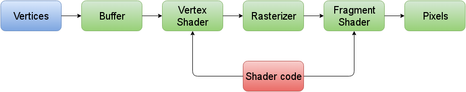

<!-- Shaders - also great for 2D graphics -->
# Shaders - also great for 2D graphics

## A WebGL primer

Before we can use shaders, we need to understand WebGL *from the 10,000 ft view* at least.



### Preparations

WebGL is using a `Canvas`-Element to render on, so we'll need a little bit of HTML first:

```html
<doctype html>
<html>
<body>
  <canvas width="500" height="500"></canvas>
</body>
</html>
```

Then we'll need a place to write our shader code in. The easiest way to do this for our example will be to use two scripts of type `text/plain` (so the browser doesn't run them) as containers for the source code.

Shaders always come in pairs (a vertex shader and a fragment shader), so we'll create one such script container for each:

```html
<script id="vertShaderSrc" type="text/plain" src="vertex.shader"></script>
<script id="fragShaderSrc" type="text/plain" src="fragment.shader"></script>
```

We can then write the files `vertex.shader` for our vertex shader and `fragment.shader` for our fragment shader. For now, we'll fill them with minimal shader code:

In `vertex.shader`:
```glsl
attribute vec2 aVertex;

void main(void) {
  gl_Position = vec4(aVertes, 1.0, 1.0);
}
```

In `fragment.shader`:
```glsl

void main(void) {
  gl_FragColor = vec4(1.0, 1.0, 1.0, 1.0);
}
```

Last but not least, in our HTML-File, we create a script-element that grabs the Canvas element and creates a WebGL-Context that we can use to make WebGL api calls:

```javascript
var gl = document.querySelector('canvas').getContext('webgl')

// Now we do some initial setup
```

Now we can go write a bunch of JavaScript to get WebGL to put points on screen...

### Getting WebGL to draw

It all starts with a bunch of points on screen, called *vertices*.
WebGL needs these vertices to be in a simple, one-dimensional array of the form

```javascript
var vertices = [ x1, y1, x2, y2, ...]
```
These vertices are 2D coordinates in this article, but it could also be `[x1, y1, z1, x2, y2, z2, ...]` if we'd be working with 3D coordinates.

In our example, we'll draw a single triangle with the following points (note: (0,0) is the center of the screen):

```javascript
var vertices = [
  -1.0, -1.0, // first point, bottom left
   1.0, -1.0, // second point, bottom right
   0.0,  1.0  // third point, top middle
]
```

The next step is to bring these values into the graphics memory by creating a buffer and filling it with a typed version these points:

```javascript
var buffer = gl.createBuffer()
```
