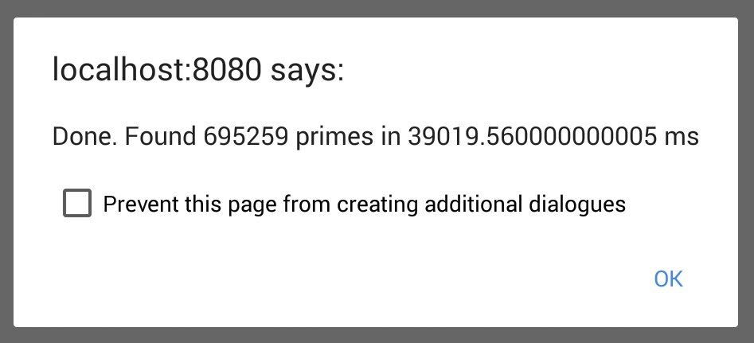
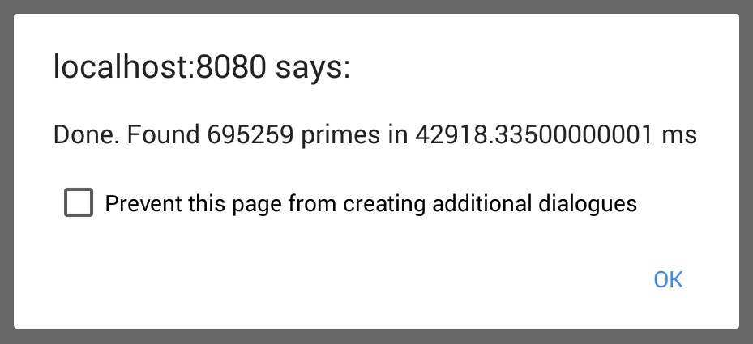
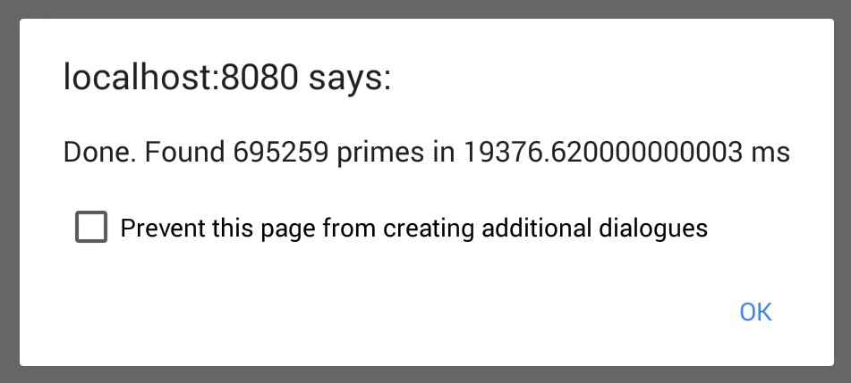
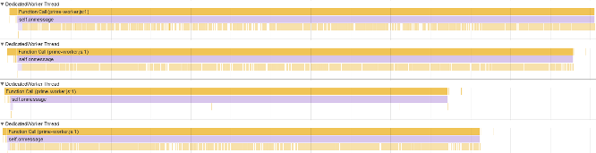
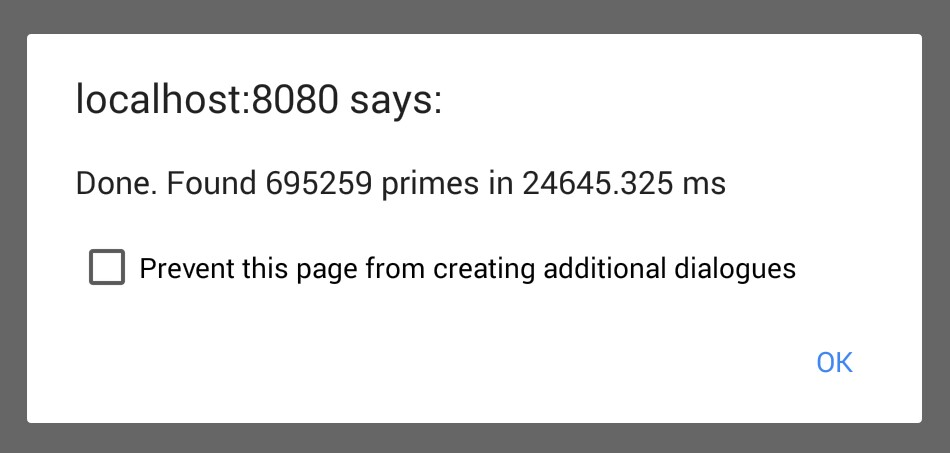
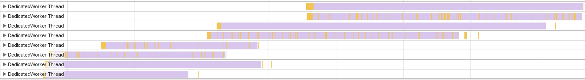

# Exploring parallelism in JavaScript: Workers, transferable objects and SharedArrayBuffer

## TL;DR

* JavaScript is single-threaded and long-running scripts make the page unresponsive
* Web Workers allow running JavaScript in separate threads, communicating with the main thread using messages.
* Messages that transfer large amount of data in TypedArrays or ArrayBuffers cause large memory cost due to data being cloned
* Using transfers mitigates the memory cost of cloning, but makes the data inaccessible to the sender
* SharedArrayBuffers are an upcoming feature, allowing data to be shared between threads.
* SharedArrayBuffer access can (and may need to) be synced using Atomics

## An example application

As an example we want to build a web application that constructs a table where each entry denotes if the number that belongs to it is [prime](https://en.m.wikipedia.org/wiki/Prime_number) or not.

We will use an [ArrayBuffer](https://developer.mozilla.org/en/docs/Web/JavaScript/Reference/Global_Objects/ArrayBuffer) to hold our booleans for us and we will be bold and make it 10 megabyte large.

Now this just serves to have our script do some heavy lifting - it isn't a very useful thing, but I may use techniques described here in future posts dealing with binary data of different sorts (images, audio, video for instance). 

Here we will use a very naive algorithm (there are much better ones available):

```javascript
function isPrime(candidate) {
  for(var n=2; n<Math.floor(Math.sqrt(candidate)); n++) {
    // if the candidate can be divided by n without remainder it is not prime
    if(candidate % n === 0) return false
  }
  // candidate is not divisible by any potential prime factor so it is prime
  return true
}
```

Here is the rest of our application:

### index.html

```html
<!doctype html>
<html>
<head>
  <style>
    /* make the page scrollable */
    body {
      height: 300%;
      height: 300vh;
    }
  </style>
<body>
  <button>Run test</button>
  <script src="app.js"></script>
</body>
</html>
```

We make the page scrollable to see the effect of our JavaScript code in a moment.

### app.js

```javascript
document.querySelector('button').addEventListener('click', runTest)

function runTest() {
  var buffer = new ArrayBuffer(1024 * 1024 * 10) // reserves 10 MB
  var view = new Uint8Array(buffer) // view the buffer as bytes
  var numPrimes = 0

  performance.mark('testStart')
  for(var i=0; i<view.length;i++) {
    var primeCandidate = i+2 // 2 is the smalles prime number
    var result = isPrime(primeCandidate)
    if(result) numPrimes++
    view[i] = result
  }
  performance.mark('testEnd')
  performance.measure('runTest', 'testStart', 'testEnd')
  var timeTaken = performance.getEntriesByName('runTest')[0].duration

  alert(`Done. Found ${numPrimes} primes in ${timeTaken} ms`)
  console.log(numPrimes, view)
}

function isPrime(candidate) {
  for(var n=2; n < Math.floor(Math.sqrt(candidate)); n++) {
    if(candidate % n === 0) return false
  }
  return true
}
```

We are using the [User Timing API]() to measure time and add our own information into the timeline.

Now I let the test run on my trusty "old" Nexus 7 (2013):



Okay, that's not very impressive, is it?
Making matters worse is that the website stops reacting to anything during these nearly 39 seconds - no scrolling, no clicking, no typing. The page is frozen.

This happens because JavaScript is single-threaded and in a single thread only one thing can happen at the same time. Making matters worse, pretty much anything that is concerned with interactions for our page (so browser code for scrolling, entering text etc.) runs *on the same thread*.

So is it that we just cannot do any heavy lifting?

## Web Workers to the rescue

No. This is just the kind of work we can use [Web Workers](https://developer.mozilla.org/en-US/docs/Web/API/Web_Workers_API).

A Web Worker is a JavaScript file from the same origin as our web application that will be running in a separate thread.

Running in a separate thread means:

* it will run in parallel
* it will not make the page unresponsive by blocking the main thread
* it will not have access to the DOM or any variable or function in the main thread
* it can use the network and communicate with the main thread using messages

So how do we keep our page responsive while the prime-searching work goes on? Here is the procedure:

* We start a worker and send the ArrayBuffer to it
* The worker does its job
* When the worker is done, it sends the ArrayBuffer and the number of primes it found back to the main thread

Here is the updated code:

### app.js

```javascript
document.querySelector('button').addEventListener('click', runTest)

function runTest() {
  var buffer = new ArrayBuffer(1024 * 1024 * 10) // reserves 10 MB
  var view = new Uint8Array(buffer) // view the buffer as bytes

  performance.mark('testStart')
  var worker = new Worker('prime-worker.js')
  worker.onmessage = function(msg) {
    performance.mark('testEnd')
    performance.measure('runTest', 'testStart', 'testEnd')
    var timeTaken = performance.getEntriesByName('runTest')[0].duration
    view.set(new Uint8Array(buffer), 0)
    alert(`Done. Found ${msg.data.numPrimes} primes in ${timeTaken} ms`)
    console.log(msg.data.numPrimes, view)
  }
  worker.postMessage(buffer)
}
```

### prime-worker.js

```javascript
self.onmessage = function(msg) {
  var view = new Uint8Array(msg.data),
      numPrimes = 0
  for(var i=0; i<view.length;i++) {
    var primeCandidate = i+2 // 2 is the smalles prime number
    var result = isPrime(primeCandidate)
    if(result) numPrimes++
    view[i] = result
  }
  self.postMessage({
    buffer: view.buffer,
    numPrimes: numPrimes
  })
}

function isPrime(candidate) {
  for(var n=2; n < Math.floor(Math.sqrt(candidate)); n++) {
    if(candidate % n === 0) return false
  }
  return true
}
```

And here is what we get when run again on my Nexus 7:



Well, uhm, did all that ceremony give us anything then? After all now it is even *slower*!

The big win here wasn't making it faster, but try scrolling the page or otherwise interacting... **it stays responsive at all times**! With the calculation being ferried off to its own thread, we don't get in the way of the main thread taking care of responding to the user.

But before we move on to make things faster, we shall figure out an important detail on how `postMessage` works.

## The cost of cloning

As mentioned earlier the main thread and worker thread are separated so we need to shuttle data between them using messages

But how does that actually move data between them? The answer for the way we have done it before is [structured cloning](https://developer.mozilla.org/en-US/docs/Web/API/Web_Workers_API/Structured_clone_algorithm).

This means we are **copying** our 10 megabyte ArrayBuffer to the worker and then copy the ArrayBuffer from the worker back.

I assumed this would total in 30 MB memory usage: 10 in our original ArrayBuffer, 10 in the copy sent to the worker and another 10 in the copy that is sent back.

Here is the memory usage before starting the test:


And here right after the test:


Wait, that is 50 megabytes more. As it turns out:

* we start with 10mb for the ArrayBuffer
* the cloning itself* creates another 10mb
* the clone is copied to the worker, +10mb
* the worker clones its copy again, +10mb
* the cloned copy is copied to the main thread, +10mb

*) I am not exactly sure why the clone is not moved to the target thread instead of being copied, but the serialialisation itself seems to be incurring up the unexpected memory

## Transferables save the day

Luckily for us there is a different way of transferring data between the threads in the optional second parameter of `postMessage`, called the *transfer list*.

This second parameter can hold a list of [Transferable](https://developer.mozilla.org/en-US/docs/Web/API/Transferable) objects that will be excluded from cloning and will be moved or *transferred* instead.

Transferring an object, however, neuters it in the source thread, so for instance our ArrayBuffer won't contain any data in the main thread after it's been transferred to the worker and its `byteLength` will be zero. 
This is to avoid the cost of having to implement mechanisms to deal with a bunch of issues that can happen when multiple threads access shared data.

Here is the adjusted code using transfers:

### app.js

```javascript
worker.postMessage(buffer, [buffer])
```

### prime-worker.js

```javascript
  self.postMessage({
    buffer: view.buffer,
    numPrimes: numPrimes
  }, [view.buffer])
```

And here are our numbers:


So we got a little faster than the cloning worker, close to the original main-thread-blocking version. How are we doing in terms of memory?


So having started with 40mb and ending up with a little more than 50mb sounds about right.

## More workers = more speed?

So up until now we have
* unblocked the main thread
* removed the memory overhead from cloning

Can we speed it up as well?

We could split the range of numbers (and our buffer) among multiple workers, run them in parallel and merge the results:

### app.js

Instead of launching a single worker, we are about to launch four. Each worker will receive a message instructing it with the offset to begin with and how many numbers to check.

When a worker finishes, it reports back with 

* an ArrayBuffer containing the information about which entries are prime
* the amount of primes it found
* its original offset
* its original length

We then copy the data from the buffer into the target buffer, sum up the total number of primes found.

Once all workers completed, we display the final results.

```javascript
document.querySelector('button').addEventListener('click', runTest)

function runTest() {
  const TOTAL_NUMBERS = 1024 * 1024 * 10
  const NUM_WORKERS = 4
  var numbersToCheck = TOTAL_NUMBERS, primesFound = 0
  var buffer = new ArrayBuffer(numbersToCheck) // reserves 10 MB
  var view = new Uint8Array(buffer) // view the buffer as bytes

  performance.mark('testStart')
  var offset = 0
  while(numbersToCheck) {
    var blockLen = Math.min(numbersToCheck, TOTAL_NUMBERS / NUM_WORKERS)
    var worker = new Worker('prime-worker.js')
    worker.onmessage = function(msg) {
      view.set(new Uint8Array(msg.data.buffer), msg.data.offset)
      primesFound += msg.data.numPrimes

      if(msg.data.offset + msg.data.length === buffer.byteLength) {
        performance.mark('testEnd')
        performance.measure('runTest', 'testStart', 'testEnd')
        var timeTaken = performance.getEntriesByName('runTest')[0].duration
        alert(`Done. Found ${primesFound} primes in ${timeTaken} ms`)
        console.log(primesFound, view)
      }
    }
    
    worker.postMessage({
      offset: offset,
      length: blockLen
    })
    
    numbersToCheck -= blockLen
    offset += blockLen
  }
}
```

### prime-worker.js

The worker creates a Uint8Array view large enough to hold the `length` bytes as ordered by the main thread.

The prime checks start at the desired offset and finally data is transferred back.

```javascript
self.onmessage = function(msg) {
  var view = new Uint8Array(msg.data.length),
      numPrimes = 0
  for(var i=0; i<msg.data.length;i++) {
    var primeCandidate = i+msg.data.offset+2 // 2 is the smalles prime number
    var result = isPrime(primeCandidate)
    if(result) numPrimes++
    view[i] = result
  }
  self.postMessage({
    buffer: view.buffer,
    numPrimes: numPrimes,
    offset: msg.data.offset,
    length: msg.data.length
  }, [view.buffer])
}

function isPrime(candidate) {
  for(var n=2; n < Math.floor(Math.sqrt(candidate)); n++) {
    if(candidate % n === 0) return false
  }
  return true
}
```

And here are the result:




So this solution took approximately half the time with quite some memory cost (40mb base memory usage + 10mb for the target buffer + 4 x 2.5mb for the buffer in each worker + 2mb overhead per worker.

Here is the timeline of the application using 4 workers:



We can see that the workers run in parallel, but we aren't getting a 4x speed-up as some workers take longer than others. This is the result of the way we divided the number range: As each worker needs to divide each number `x` by all numbers from 2 to `√x`, the workers with larger numbers need to do more divisions, i.e. more work. This can surely minimised by dividing the numbers in a way that ends up spreading the operations more equally among them. I will leave this as an exercise to you, the keen reader ;-)

Another question is: Could we just throw more workers at it?

Here is the result for 8 workers:



Well, this got slower! The timeline shows us why this happened:



We see that, aside from minor overlaps, no more than 4 workers are active at the same time.
This will depend on the system and worker characteristics and isn't a hard-and-fast number.

A system can only do so much at the same time and work is usually either *I/O-bound* (i.e. limited by network or file throughput) or *CPU-bound* (i.e. limited by running calculations on the CPU).

In our case all a worker does is hogging up the CPU for our calculations. As my Nexus 7 has four cores, it can deal with four of our fully CPU-bound workers simultaneously.

Usually you will end up with a mix of CPU- and I/O bound workloads or problems that aren't easy to chunk in smaller workloads, so I would say 4 workers are a good number for workers where you can parallelise the solution.

## Sharing space with SharedArrayBuffers

Web Workers, TypedArrays and Transferables have been around for a good while now and found their ways into most browsers. Our next trick, [being part of ES2017](), on the other hand is rather new and will likely require a browser flag or a preview version of your favourite browser (or both).

I am talking about a [SharedArrayBuffer](https://developer.mozilla.org/en-US/docs/Web/JavaScript/Reference/Global_Objects/SharedArrayBuffer).

A SharedArrayBuffer works pretty much like an ArrayBuffer but comes with two important differences:

* it can not be transferred
* when it is cloned to a worker in a `postMessage` call, its memory is not allocated a second time, but both instances will share the same underlying block of memory (but the two instances are independent apart from acessing the same memory)

Here is the adjusted code:

### app.js

Our main application changes three things:

* it uses a SharedArrayBuffer for the target buffer
* it clones the buffer (as it can't be transferred) but without incurring the full memory cost
* it doesn't need to copy back the buffers from the workers as the data will be put in the target buffer's memory directly by the workers

```javascript
document.querySelector('button').addEventListener('click', runTest)

function runTest() {
  const TOTAL_NUMBERS = 1024 * 1024 * 10
  const NUM_WORKERS = 4
  var numbersToCheck = TOTAL_NUMBERS, primesFound = 0
  var buffer = new SharedArrayBuffer(numbersToCheck) // reserves 10 MB
  var view = new Uint8Array(buffer) // view the buffer as bytes

  performance.mark('testStart')
  var offset = 0
  while(numbersToCheck) {
    var blockLen = Math.min(numbersToCheck, TOTAL_NUMBERS / NUM_WORKERS)
    var worker = new Worker('prime-worker.js')
    worker.onmessage = function(msg) {
      primesFound += msg.data.numPrimes

      if(msg.data.offset + msg.data.length === buffer.byteLength) {
        performance.mark('testEnd')
        performance.measure('runTest', 'testStart', 'testEnd')
        var timeTaken = performance.getEntriesByName('runTest')[0].duration
        alert(`Done. Found ${primesFound} primes in ${timeTaken} ms`)
        console.log(primesFound, view)
      }
    }
    
    worker.postMessage({
      buffer: buffer, // SharedArayBuffers can't be transferred
      offset: offset,
      length: blockLen
    })
    
    numbersToCheck -= blockLen
    offset += blockLen
  }
}
```

### prime-worker.js

The worker cose differs in that the view being used to store the results is created at the current offset in the SharedArrayBuffer and it won't send the buffer back.

Note that `view[0]` in the worker will end up at `buffer[offset]` in the main thread as `view` has been initialised to start there in the worker.

```javascript
self.onmessage = function(msg) {
  var view = new Uint8Array(msg.data.buffer, msg.data.offset, msg.data.length),
      numPrimes = 0
      
  console.log('start', msg.data.offset+2, 'before', msg.data.offset+2+msg.data.length)
  for(var i=0; i<msg.data.length;i++) {
    var primeCandidate = i+msg.data.offset+2 // 2 is the smalles prime number
    var result = isPrime(primeCandidate)
    if(result) numPrimes++
    view[i] = result
  }
  self.postMessage({
    numPrimes: numPrimes,
    offset: msg.data.offset,
    length: msg.data.length
  })
}

function isPrime(candidate) {
  for(var n=2; n < Math.floor(Math.sqrt(candidate)); n++) {
    if(candidate % n === 0) return false
  }
  return true
}
```

Now for the results:


I'd call this a win: We cut down the memory cost and shaved of a tiny bit of time.

### The race and what to do against it

Earlier on I noted that ArrayBuffer isn't shareable due to issues with multiple threads accessing the same memory. The SharedArrayBuffer requires the browser (which might in turn relay the duty to the operating system) to prevent such problems. That is nice, isn't it?

It is *very* nice and if you ever had to deal with concurrent shared memory access, you're probably nodding along in agreement.

Now it does require a little attention though nut that is absolutely fine as it puts you in control without putting the burden of ensuring conflict-free access.

When we write to a SharedArrayBuffer, the data might not immediately be visible in other threads. Also will the code, when compiled for optimisation, require a few hints on how we are using the buffer across threads in order to remove things which would be good to remove if it weren't for our multithread usage.

### Atomics

TBD

## Wrap up

This was quite a lot to take in, so let's recap!

We found out that **JavaScript is single-threaded** and runs on the same thread as the browser tasks to keep our UI fresh and snappy.

We then used **Web Workers** to offload our work to separate threads and used `postMessage* to.communicate between the threads.

We noticed that threads don't scale infinitely, so some consideration for the amount of threads we run is advised.

When doing so we found out that **data gets cloned by default** which easily incurs more memory toll than meets the eye.

We fixed that via **transferring data** which is a viable option for certain types of data, referred to as [Transferables]( https://developer.mozilla.org/en-US/docs/Web/API/Transferable).

We the experimented with a new type of data structure, SharedArrayBuffer, which is **sharing the memory**. This may **require some syncing** with Atomics.
