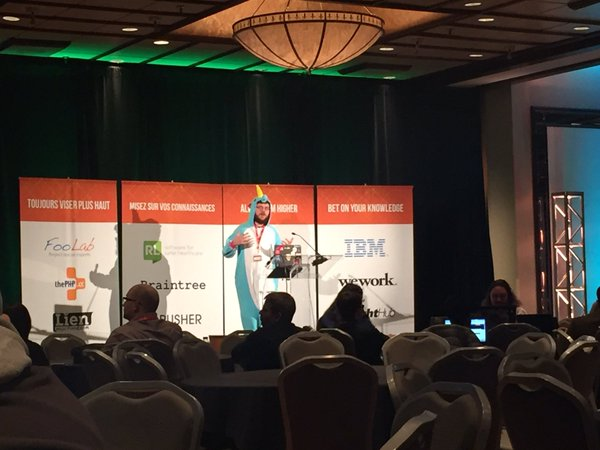
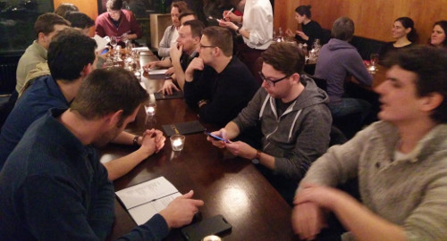
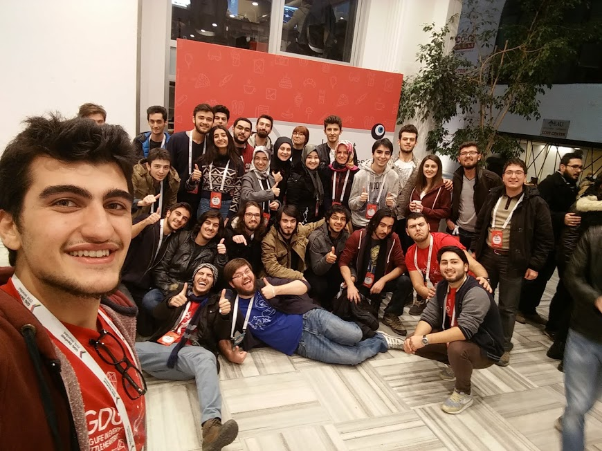
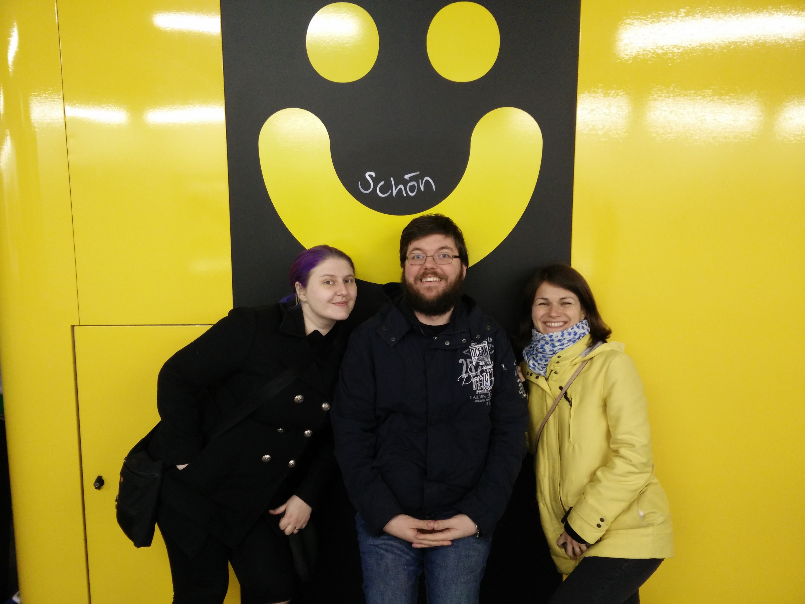
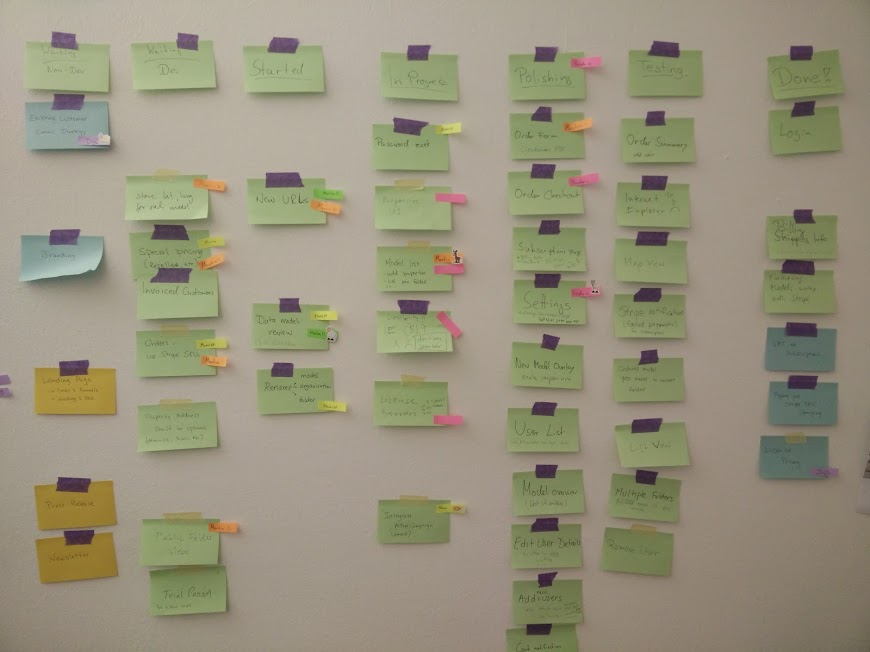
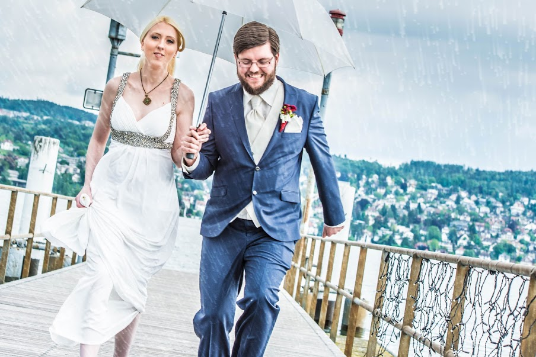

<!-- 2016: The year in review -->

# 2016 - the year in review

## Sharing knowledge

This year I finally finished the draft of my book on Polymer!
If things work out, it will be in print at the beginning of next year... which makes me very happy.
Right after finishing the raw script in May (a mere week before my wedding) I swore I'd never write a book again but I was very happy to have pushed through. Fun fact: I am writing another book now, so there's that.

I also had the honour to give an [interview about WebVR](https://habrahabr.ru/company/jugru/blog/315868/) to the russian Java User Group. It's in Russian, but Google Translate seems to be keeping up with it quite well.

Right now I have a few more writing projects brewing, both for books and articles, so watch this space if you're interested in me sharing more of the things I failed at and what I learned while doing so.

In addition, I am happy to announce that I am now also a [Google Developer Expert]() for Web. This means that Google will support me in mentoring and helping developers and creating content to share my knowledge with the broader web developer community.

## Conference tour

On the notion of sharing knowledge:

This year I had the honour to speak at 26 events in 16 different countries, giving a total of 33 talks and workshops.
I really enjoy the opportunity to share the things I've learned or experience I've painstakingly made by "doing it all wrong"&amp;trade;!

It's a huge privilege to have one's voice amplified by being in front of an audience (possibly even recorded and published).
I wish this privilege to be available for more people with fresh perspectives and new experiences. Which brings me to the next point...

## The community: Global and local

I enjoy participating in all those events, because I love to meet new people, hear about their experiences and share mine with them.
Meeting different communities is amazing - it's a very powerful way to establish connections to solve a broad variety of challenges together!

Speaking of that, I am very happy that [Web Zürich](http://webzueri.ch) has taken off with six successful editions of lightning talks and lots of chit chat (and drinks) afterwards!

My goal of bringing together people working on the many facets of "making the web" seems to have struck a chord with people.

We've had amazing talks about a broad range of topics from design over development to security and UX. Our meetup is monthly and we have around 40 people joining each month.

If you're in or around Zürich, [head over to our website](http://www.webzueri.ch) and check out one of our meetups :)

In addition, I had the great honour to be guiding through the final presentations of the [Jugend Hackt projects](https://www.youtube.com/watch?v=_2lsOBaIm0U&t=3921s) this year - it's great to see so many young people making ideas become reality.

## Meeting old and new friends

With communities come a lot of people and friendships.

I am really grateful for the warmth and welcoming attitude of the communities I was invited to in the past and look forward to meeting more lovely folks around the globe in the future.

I'd like to highlight two especially amazing people: [Carmen](https://twitter.com/carmenpopoviciu) and [Myriam](https://twitter.com/myriamjessier) who are very nice, supportive, energetic and lovely folks - I am very happy to have them in my life!

What I enjoy the most is that the software development community is open enough to share insights as well as struggles and challenges - even though some people unfortunately don't understand that we're in the same boat - most people are happy to provide help and great ideas that make us a strong, thriving, global team.

## Archilogic

Speaking of "team" - our Archilogic family has also been growing, which means I get to work with even more friends!

I'm really happy to have such a great bunch of people to work with to reach a shared vision.

We've accomplished a lot this year:

* We've launched [spaces.archilogic.com](https://spaces.archilogic.com)
* Performance improvements due to our own internal 3D format
* We have a more powerful material editing system then ever before
* New furniture, new 3D objects
* We have import for IFC files and export to DXF
* We got to work with the Google Tango team
* We now support import and export of [glTF](https://www.khronos.org/gltf) files
* We're about to release WebVR 1.1 support

Besides that we did a lot of refactoring and stability improvements to be able to allow future innovation and extension.

It's been an amazing year with lots of learnings, successes and mistakes - and a whole lotta fun!

## Last but not least: A very special day

This is probably the most important event of 2016, at least for me it certainly is.

After five years of living, laughing and loving together, I married my wonderful wife Anne. That also marked the turning point of me being "Martin Naumann" and changing my name to Splitt.

Our wedding was a wonderful day in which we could share the love and warmth of our relationship with all our family and friends.

And we're sure that this is just the beginning.

## What's up in 2017?

So with 2016 shelved, what's in store for 2017?

I don't know much yet, but I can certainly see [the first few conferences lining up](http://geekonaut.de/speaking) and
the continuation of my writing projects will certainly take some time out of this year.

I hope I get to work with my co-workers on more amazing things at Archilogic, for instance the upcoming closed-beta of our SDK environment and opening of our APIs.

VR will be another topic I will continue working with - especially trying to find interactions and interface patterns that fit the new way of experiencing content well.

I look forward to meeting more communities and visiting old friends again and share ideas and knowledge with them!

To an exciting and successful 2017 for all of you!
