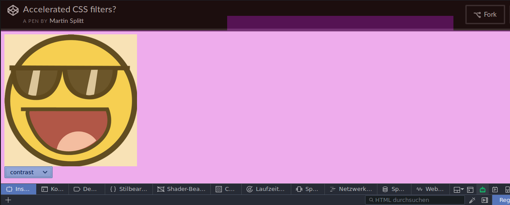

<!-- My Firefox month: Day 1 -->
# My Firefox month: Day 1

## TL;DR

* I will try Firefox 54 on my laptops and phone for a month
* Firefox Sync provides me with seamless access to my tabs, bookmarks, autofill data etc. across devices
* Using Firefox with multiple profiles is easier with an Add-On like "Profile Switcher"
* The first day had a bunch of pleasant surprises in the dev tools

## Welcome to my month with Firefox!

The web is an amazing platform due to it's flexibility, resilience, versatility and openness.
Part of this resilience and openness stems from the variety of browsers available to access the web.

Yet, I have left Firefox a few years ago after struggling with sluggish performance, a lack of features and missing features in its developer tooling.

I've reduced my Firefox usage along with the other browsers that only start on my system when I test my applications.

However, **yesterday Firefox 54 was released** and the twittersphere convinced me to give it another shot!

So here it goes:

**From today, June 14th, I will try to use Firefox for one month until July 14th.**

I will also write a daily* post with my findings and will try if I can contribute something back where it's feasible and needed.

*) unless I've got a summer day where I'm not touching the computer, then - no post...

## Installing Firefox 54

Even though the release announcement was published on the 13th already, I could not get a build for Linux or Android.
So my first attempts to get the 54 stable release were either leading to Firefox 53 or Firefox 54 Beta.

However, today I was able to download and install Firefox 54 as intended.

## Firefox Sync

As I'm often switching between my phone and my laptop(s), I rely a lot on the ability to see the open tabs from another device to reopen them on the device I'm currently working on. That's why I was very happy to see that Firefox has **Firefox Sync**.

I logged in with my trusty old Firefox account and off I went.

## Multiple profiles

I more-or-less stricly separate work accounts from private ones, so I'm used to having multiple profiles in Chrome.
I was wondering if Firefox has a comparably comfortable way of switching profile as Chrome did to find out that it doesn't.

Luckily Firefox can count on the active extension community, so I had a few extensions to pick from to get the same level of comfort.

There were two addons that caught my eye:

- Profile Switcher: This one promised to add a little profile icon to the status bar
- Profilist: This one added the profile list into the "hamburger" menu

### Profilist
Profilist worked as advertised. I installed the addon and the profiles appeared in the hamburger menu.
Unfortunately, though, it turned out to be half-baked in my opinion. It has no apparent way of launching the profile manager and adding profiles will create "Unnamed-Profile-1" etc. with no way of choosing a name or renaming the profile.

### Profile Switcher
Profile switcher appeared to not be working at first. I installed it, but nothing showed up. I double checked the settings to find it was expected to appear as an icon in the "status bar" but I didn't see it anywhere.

Using the "Customize" option in the menu finally allowed me to drag it into the tab bar to appear on my screen.
From then on, the addon worked perfectly: I could see which profile I was using, create new profiles or launch the profile manager.

## Dev tools

One big surprise to me were the developer tools. I knew of the **Shader Editor** already, which is pretty cool when I work with WebGL or WebVR.

A few features surprised me though, for instance:

- **"Highlight redrawn areas"** which corresponds to "Flash paint rectangles" in Chrome, but it works slightly differently.

- **"Dimensions"** tool to measure elements on the website and their position 

- **"Network analysis"** to give a breakdown of the network load by resource type, with and without cache

~~One thing I was missing, though, was the ability to pick the document in the JavaScript console. If you're using iframes this feature comes in handily as it allows you to pick which `document` you want to inspect.~~

**Update**: Thanks to [Julien Wajsberg](https://twitter.com/jwajsberg/status/875089442444378117) I found the devtool setting to enable an additional button to select the document to inspect when iframes are present!

## Summary

All in all I have to say I am really happy and impressed with Firefox 54 so far.

It's fast, it's working well and I'm not missing much yet :-)

## The entire saga so far

* [Firefox day 1](2017-06-14-my-firefox-month-day-1)
* [Firefox day 2](2017-06-15-firefox-day-2-first-few-cracks)
* [Firefox day 3](2017-06-16-firefox-day-3-details)
* [Firefox day 4](2017-06-17-firefox-day-4-goin-up-the-country)
* [Firefox day 5](2017-06-18-firefox-day-5-a-race)