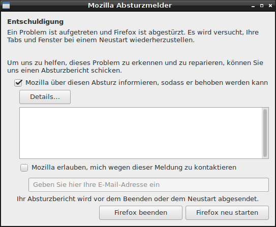

<!-- Firefox day 3: -->
<!-- DRAFT -->

# Firefox day 3:

## Comeback of the ads

When switching browsers three days ago, I forgot to install an ad blocker.
I have to say I'm surprised **how well Firefox seems to deal with ads** as I haven't really noticed any ads up to this point.

However, the day had to come where an ad banner popped into a website, prompting me to install [uBlock origin](https://addons.mozilla.org/en/firefox/addon/ublock-origin/?src=hp-dl-featured).

## The crash that wasn't

When I switched profiles I got the crash reporter popup, but interestingly **without Firefox actually crashing**.
I assume whatever part was crashing did so invisibly and Firefox lives by "better safe than sorry" :-D

## Stuck on 53 for Android

Another thing I noticed is that for some reason my phone seems to be **stuck on Firefox for Android 53**.

It's an Android 7 phone with no carrier-lock which makes this a strange occurrence. I also tried uninstalling and re-installing Firefox to no avail - I guess I'll be sailing with 53 on Android then.

## No show

Another thing I noticed is that **some videos don't play** on Android. They play just fine in Chrome, but refuse to show in Firefox.

Also I've noticed that **Hangouts isn't working** - but that's rather a problem of Hangouts than a problem of Firefox (yet, from a user's perspective that doesn't matter much).

**One particular image didn't show up** on Twitter, too.
All the other images showed just fine, but this one didn't want to. Other browsers worked fine, though.

## Groundhog day on Twitter

Another strange thing happened on the "Twitter Lite" PWA:

Basically whenever the app gets closed, it **forgets that there's a cookie** being set for the "Cookie policy" popover and displays it again.

I'll have to see if I can reproduce that problem with other pages or if it's specific to Twitter's PWA.

## Cool stuff

Today I found some cool stuff as well.
On Android, when I tell a link to "Open in new tab" it doesn't just pop up in the foreground or background; it opens the tab in the background without interrupting your flow, but displays a little tooltip that allows you to switch to the new tab with a single tap of your finger.

Also, when opening links in Emails instead of awkwardly opening it in an "In App" browser (that doesn't show up as a separate browser window and may disappear if you tap on a notifcation from the same app you're in), Firefox 

## Overall impression

Today is the day I stopped feeling weird for not opening my "default browser" and I went as far as allowing Firefox to set itself as my default browser on both my laptops and my phone.

The overall browsing experience is pretty smooth and enjoyable and the many small details really pay off - e.g. I felt awkward in the Firefox devtools at first as their structure and look &amp; feel is quite different from Chrome's, but the shader editor and the "Screenshot DOM node" feature are really, really handy.

## The entire saga so far

[Firefox day 1](2017-06-14-my-firefox-month-day-1)
[Firefox day 2](2017-06-15-firefox-day-2-first-few-cracks)
[Firefox day 3](2017-06-16-firefox-day-3-details)