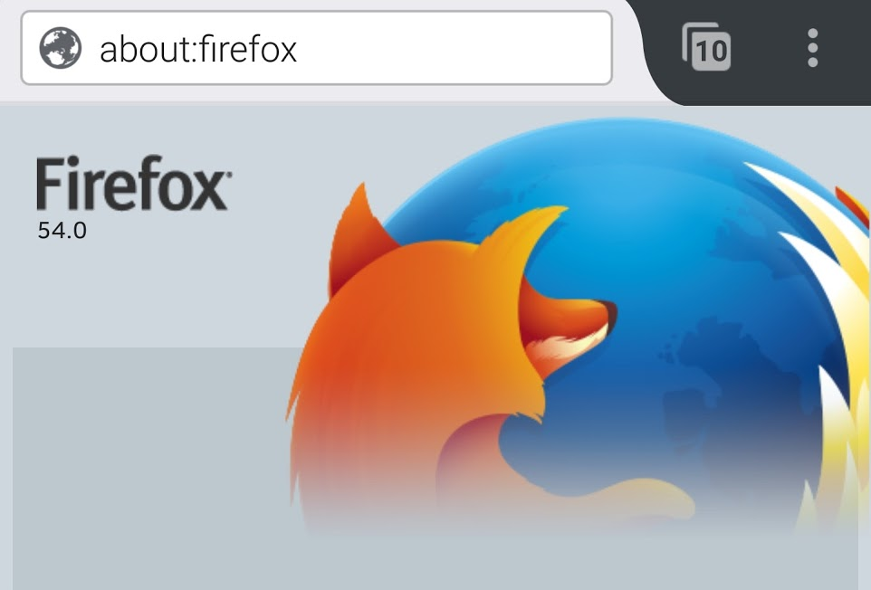
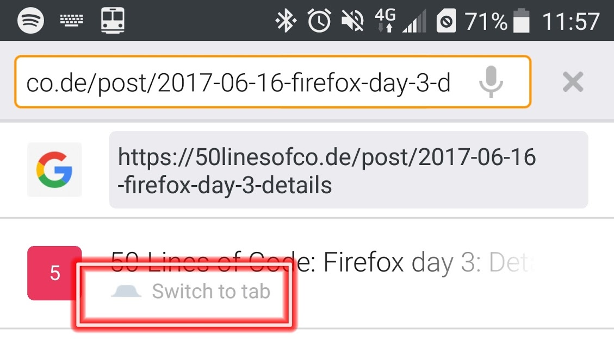
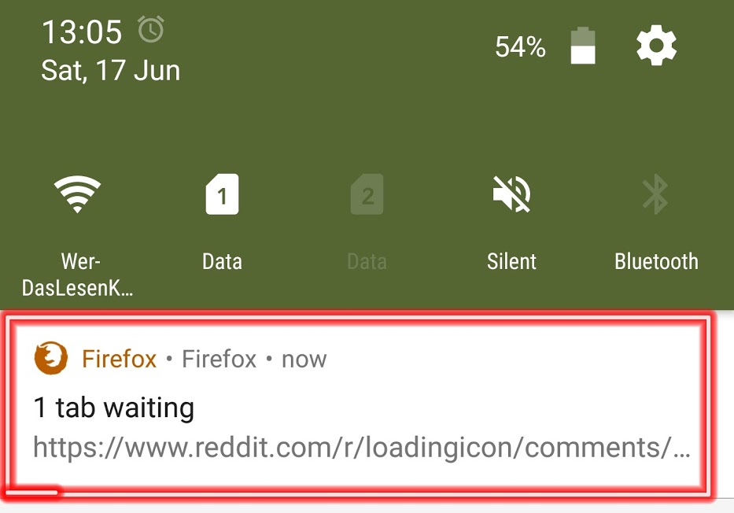

<!-- Firefox day 4: Goin' up the country -->

# Firefox day 4: Goin' up the country

With the weather being amazing today, I got to use Firefox on my phone a lot.
Also, **finally I got Firefox 54 on my phone**!

## Useful little things

I've found a few niceties besides the fact that **apps open links with Firefox in the background and with a little button you can tap to switch** directly to the browser - let's look at those!

For instance Firefox **detects if you already have an open tab with the URL** you're typing in. It then offers the possibility to jump tho that tab immediately:

It also indicates if the **URL can be opened in an installed app** on the phone:

The little Android icon in the address bar can be tapped and opens the URL in the app - in this case in YouTube.

Also, tabs that are opened via an app and **wait in the background show up in the notifications**, which allows for a quite nice way of accessing them later on:

## Another one who doesn't play nicely...

We had a dinner with friends and decided to play a few games real quick. [AirConsole](http://www.airconsole.com) is pretty cool for this: One Smart TV or computer hooked up to a TV screen is the "game console" and everyone uses their smartphones or tablets as controllers by entering the "Session number" and joining the party.

All you need is your browser - exceptfor Firefox users. The page suggests to use Chrome as it "works better with Air Console". So no points to Huffle Puff, err, Mozilla from Air Console.

I'll ping them to see if that claim still holds true and what needs to happen to fix that.

So, that's it for today. Tomorrow I'll take a look at how Firefox compares to Chrome in a deeper analysis.

## The entire saga so far

[Firefox day 1](2017-06-14-my-firefox-month-day-1)
[Firefox day 2](2017-06-15-firefox-day-2-first-few-cracks)
[Firefox day 3](2017-06-16-firefox-day-3-details)
[Firefox day 4](2017-06-17-firefox-day-4-goin-up-the-country)