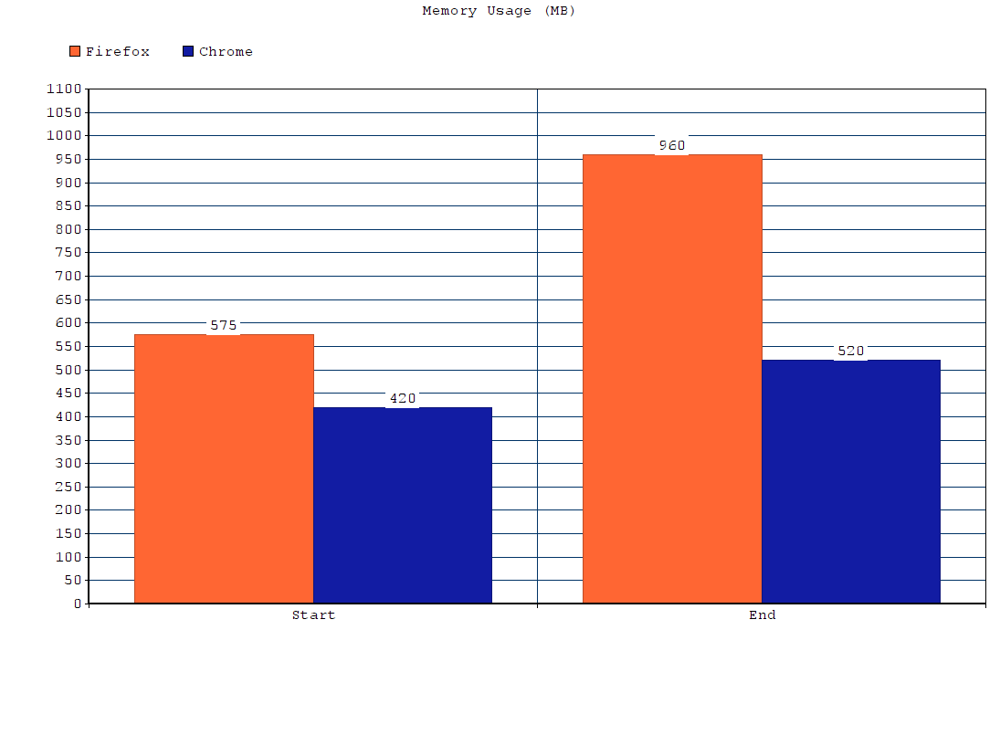

<!-- Firefox day 5: A race -->

# Firefox day 5: A race

Today I thought that it's a good time to take things for a test drive.

- I will look at memory consumption
- I'll time page loads
- I'll try the behaviour with slow and flaky connections

Let's see what we'll learn here!

## Memory

I've opened a session with four tabs:

1. Facebook
2. Twitter
3. A Stackoverflow thread
4. A Github page
5. An Archilogic model with a 3D model

I measured the total memory usage, then left them open for a 30 minutes and measured the memory usage afterwards.
Then I did the same with Firefox.

Chrome started with 420 MB when all pages where opened on Linux and consumed  520 MB after half an hour.
Firefox started with 575 MB when all pages where opened on Linux and consumed 960 MB after half an hour.

I don't know about the marketing graphic Firefox has distributed, but it doesn't reflect what I'm seeing on my Linux laptop, unless my method is wrong:

1. Launch the websites
2. Read the RSS for all browser processes

Also: Your milage may vary, I guess.

## Page loading speed

I had the feeling that pages load a little slower in Firefox, but in a series of tests I couldn't find significant differences.

Firefox:

Chrome: 

I consider the 0.2 seconds (respectively "sub second" variations) noise rather than actual "signal".

## So...

That, to me, means that memory-wise Firefox 54 isn't outperforming Chrome apparently and the pages load pretty much as fast.
As E10n ("Electrolysis"), Firefox's multiprocess rewrite, is pretty young we might see further improvements in the future. 

## The entire saga so far

* [Firefox day 1](2017-06-14-my-firefox-month-day-1)
* [Firefox day 2](2017-06-15-firefox-day-2-first-few-cracks)
* [Firefox day 3](2017-06-16-firefox-day-3-details)
* [Firefox day 4](2017-06-17-firefox-day-4-goin-up-the-country)
* [Firefox day 5](2017-06-18-firefox-day-5-a-race)