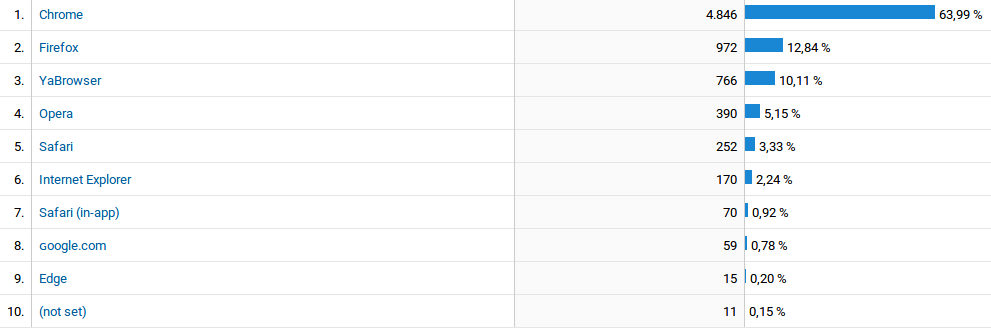
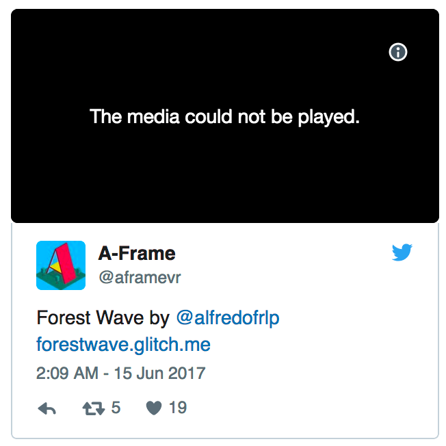
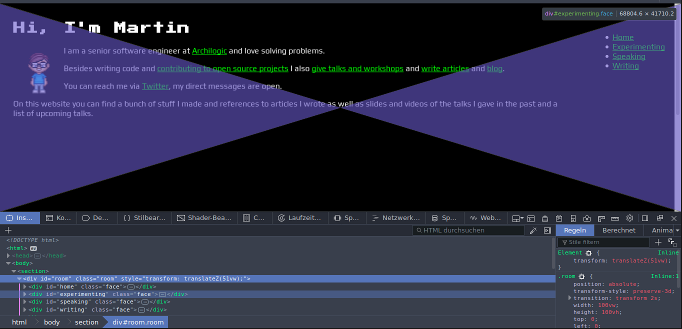

<!-- Firefox day 2: Web compat -->
<!-- DRAFT -->
# Firefox day 2: Web compat

## Web compatibility and mono culture

This experiment isn't about "open source vs. closed source", nor is it about "Browser A is better than Browser B".

What I want to highlight is that the web isn't a single-vendor platform. **Being open means diversity in browsers and standard development.**

I have no bias against Edge, Safari or others - heck, I've been seen sporting an Edge shirt on stage:

(Source: [Youtube](https://t.co/D2fwIChYea))

What I want people to keep in mind, though, is that **the web is an open, diverse platform** and that boils down to having an alternative when it comes to which browser you use.

## Web compat is everyone's responsibility

I have failed this earlier. In January (sic!) I got this message on Twitter:

So on my personal website, Firefox did not let a user click the links!

Looking at Analytics it's clear that by neglecting to fix this problem, I let down ca. 12% of my visitors.

Luckily, the problem was fixed by a newer Firefox version eventually, but other problems persisted:

## Making it right

So let's see what the problem is and what to do about it!

Besides the `overflow-x: hidden` problem, we've got another issue: Some of the faces are distorted:

This results in odd display errors:

## The web compatibility project

## Summary

The strength of the web stems from the inability for a single vendor to control or unilaterally defining the way forward for the platform. Yet, we have to be mindful about this. As users, as developers and as browser vendors.

Right now, the only two truly cross-platform browsers are Chrome and Firefox (Opera is using Chrome's engine) - Edge and Safari are bound to specific operating systems and other browsers are only available on certain devices (e.g. Samsung Internet) or mobile-only (e.g. Dolphin Browser).

Let's embrace diversity. Try out a different browser. Even if you go back, you can take cool stuff that's missing back to your browser vendor and report problems to help make the web better for everyone.