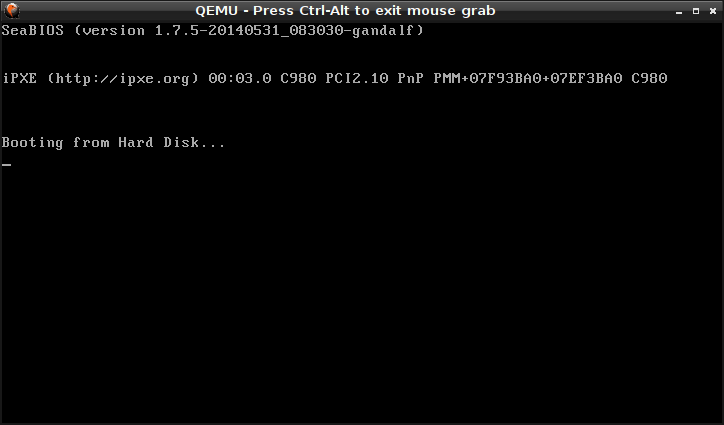
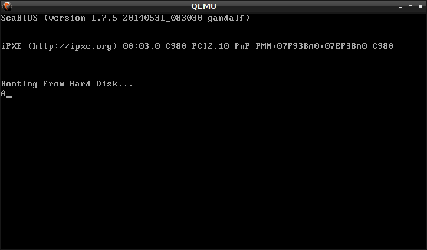
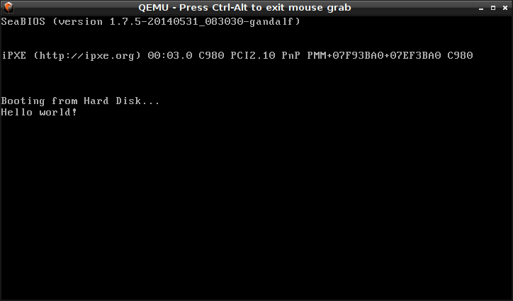

<!-- Writing an x86 "Hello world" bootloader with assembly -->
# Writing an x86 "Hello world" bootloader with assembly

## TL;DR

After booting, the BIOS of the computer reads 512 bytes from the boot devices and, if it detects a two-byte "magic number" at the end of those 512 bytes, loads the data from these 512 bytes as code and runs it. 

This kind of code is called a "bootloader" (or "boot sector") and we're writing a tiny bit of assembly code to make a virtual machine run our code and display "Hello world" for the fun of it. Bootloaders are also the very first stage of booting an operating system.


## What happens when your x86 computer starts

You might have wondered what happens when you press the "power" button on your computer. Well, without going into too much detail - after getting the hardware ready and launching the initial BIOS code to read the settings and check the system, the BIOS starts looking at the configured potential boot devices for something to execute.

It does that by reading the first 512 bytes from the boot devices and checks if the last two of these 512 bytes contain a magic number (`0x55AA`). If that's what these last two bytes are, the BIOS moves the 512 bytes to the memory address `0x7c00` and treats whatever was at the beginning of the 512 bytes as code, the so-called **bootloader**. In this article we will write such a piece of code, have it print the text "Hello World!" and then go into an infinite loop.
Real bootloaders usually load the actual operating system code into memory, change the CPU into the so-called [*protected mode*](https://en.wikipedia.org/wiki/Protected_mode) and run the actual operating system code.

## A primer on x86 assembly with the GNU assembler

To make our lives a little easier (sic!) and make it all more fun, we will use x86 assembly language for our bootloader. The article will use the GNU assembler to create the binary executable file from our code and the GNU assembler uses the "AT&amp;T syntax" instead of the pretty widely-spread "Intel syntax". I will repeat the example in the Intel syntax at the end of the article.

For those of you, who are **not** familiar with x86 assembly language and/or the GNU assembler, I created [this description](https://gist.github.com/AVGP/85037b51856dc7ebc0127a63d6a601fa) that explains just enough assembly to get you up to speed for the rest of this article. The assembly code within this article will also be commented, so that you should be able to glance over the code snippets without knowing much about the details of assembly.

## Getting our code ready

Okay, so far we know: We need to create a 512 byte binary file that contains `0x55AA` at its end. It's also worth mentioning that no matter if you have a 32 or 64 bit x86 processor, at boot time the processor will run in the **16 bit real mode**, so our program needs to deal with that.

Let's create our `boot.s` file for our assembly sourcecode and tell the GNU assembler that we'll use 16 bits:

```asm
.code16 # tell the assembler that we're using 16 bit mode
```

Ah, this is going great! Next up we should give us a starting point for our program and make that available to the linker (more on that in a few moments):

```asm
.code16
.global init # makes our label "init" available to the outside

init: # this is the beginning of our binary later.
  jmp init # jump to "init"
```

**Note** You can call your label whatever you wish. The standard would be `_start` but I chose `init` to illustrate that you can call it anything, really.

Nice, now we even got an infinite loop, because we keep jumping to the label, then jump to the label again...

Time to turn our code into some binary by running the GNU assembler (`as`) and see what we got:

```shell
as -o boot.o boot.s
ls -lh .
784 boot.o
152 boot.s
```

*Woah, hold on!* Our output is already 784 bytes? But we only have 512 bytes for our bootloader!

Well, most of the time developers are probably interested in creating an executable file for the operating system they are targeting, i.e. an `exe` (Windows), `elf` (Unix) file. These files have a header (read: additional, preceeding bytes) and usually load a few system libraries to access operating system functionality.

Our case is different: We want none of that, just our code in binary for the bios to execute upon boot.

Usually, the assembler produces an ELF or EXE file that is ready to run but we need one additional step that strips the unwanted additional data in those files. We can use the linker (GNU's linker is called `ld`) for this step.

The linker is normally used to combine the various libraries and the binary executables from other tools such as compilers or assemblers into one final file. In our case we want to produce a "plain binary file", so we will pass `--oformat binary` to `ld` when we run it. We also want to specify where our program starts, so we tell the linker to use the starting label (I called it `init`) in our code as the program's *entry point* by using the `-e init` flag.

When we run that, we get a better result:

```shell
as -o boot.o boot.s
ld -o boot.bin --oformat binary -e init boot.o
ls -lh .
  3 boot.bin
784 boot.o
152 boot.s
```
(Typo spotted by [xnumbersx](https://www.reddit.com/user/xnumbersx))

Okay, three bytes sounds much better, but this won't boot up, because it is missing the magic number `0x55AA` at bytes 511 and 512 of our binary...

## Making it bootable

Luckily, we can just fill our binary with a bunch of zeroes and add the magic number as data at the end.
Let's start with adding zeroes until our binary file is 510 bytes long (because the last two bytes will be the magic number).

We can use the the preprocessor directive `.fill` from `as` to do that. The syntax is `.fill, count,size,value` - it adds `count` times `size` bytes with the value `value` wherever we will write this directive into our assembly code in `boot.s`.

But how do we know how many bytes we need to fill in? Conveniently, the assembler helps us again. We need a total number of 510 bytes so we will fill 510 - (byte size of our code) bytes with zeroes. But what is the "byte size of our code"? Luckily `as` has a helper that tells us the current byte position within the generated binary: `.` - and we can get the position of the labels, too. So our code size will be whatever the current position `.` is after our code minus the positon of the first statement in our code (which is the position of `init`). So `.-init` returns the number of generated bytes of our code in the final binary file...

```asm
.code16
.global init # makes our label "init" available to the outside

init: # this is the beginning of our binary later.
  jmp init # jump to "init"

.fill 510-(.-init), 1, 0 # add zeroes to make it 510 bytes long
```

```shell
as -o boot.o boot.s
ld -o boot.bin --oformat binary -e init boot.s
ls -lh .
 510 boot.bin
1.3k boot.o
 176 boot.s
```

We're getting there - still missing the final two bytes of our magic word:

```asm
.code16
.global init # makes our label "init" available to the outside

init: # this is the beginning of our binary later.
  jmp init # jump to "init"

.fill 510-(.-init), 1, 0 # add zeroes to make it 510 bytes long
.word 0xaa55 # magic bytes that tell BIOS that this is bootable
```

Oh wait... if the magic bytes are `0x55aa`, why are we swapping them here?
That is because x86 is [little endian](https://en.wikipedia.org/wiki/Endianness), so the bytes get swapped in memory.

Now if we produce an updated binary file, it is 512 bytes long.

## Booting our bootloader

You could theoretically write this binary into the first 512 byte on a USB drive, a floppy disk or whatever else your computer is happy booting from, but let's use a simple x86 emulator (it's like a virtual machine) instead.

I will use QEmu with an x86 system architecture for this:

```shell
qemu-system-x86_64 boot.bin
```

Running this command produces something relatively unspectacular:


The fact that QEmu stops looking for bootable devices means that our bootloader worked - but it doesn't do anything yet!

To prove that, we can cause a reboot loop instead of an infinite loop that does nothing by changing our assembly code to this:

```asm
.code16
.global init # makes our label "init" available to the outside

init: # this is the beginning of our binary later.
  ljmpw $0xFFFF, $0 # jumps to the "reset vector", doing a reboot

.fill 510-(.-init), 1, 0 # add zeroes to make it 510 bytes long
.word 0xaa55 # magic bytes that tell BIOS that this is bootable
```

This new command `ljmpw $0xFFFF, $0` jumps to the so-called [**reset vector**](https://en.wikipedia.org/wiki/Reset_vector).
This effectively means re-executing the first instruction after the system boots again without actually rebooting. It's sometimes referred to as a "warm reboot".

## Using the BIOS to print text

Okay, let's start with printing a single character.
We don't have any operating system or libraries available, so we can't just call `printf` or one of its friends and be done.

Luckily, we have the BIOS still around and reachable, so we can make use of its functions. These functions (along with a bunch of functions that different hardware provides) are available to us via the so-called [interrupts](https://en.wikipedia.org/wiki/Interrupt).

In [Ralf Brown's interrupt list](http://www.ctyme.com/intr/alpha.htm) we can find the video interrupt 0x10.

A single interrupt can carry out many different functions which are usually selected by setting the AX register to a specific value. In our case the [function "Teletype"](http://www.ctyme.com/intr/rb-0106.htm) sounds like a good match - it prints a character given in `al` and automatically advances the cursor. Nifty! We can select that function by setting `ah` to `0xe`, put the ASCII code we want to print into `al` and then call `int 0x10`:

```asm
.code16
.global init # makes our label "init" available to the outside

init: # this is the beginning of our binary later.
  mov $0x0e41, %ax # sets AH to 0xe (function teletype) and al to 0x41 (ASCII "A")
  int $0x10 # call the function in ah from interrupt 0x10
  hlt # stops executing

.fill 510-(.-init), 1, 0 # add zeroes to make it 510 bytes long
.word 0xaa55 # magic bytes that tell BIOS that this is bootable
```

Now we're loading the necessary value into the `ax` register, call interrupt 0x10 and halt the execution (using `hlt`).

When we run `as` and `ld` to get our updated bootloader, QEmu shows us this:



We can even see that the cursor blinks at the next position, so this function should be easy to use with longer messages, right?

## Our final hello-world-bootloader

To get a full message to display, we will need a way to store this information in our binary. We can do that similar to how we store the magic word at the end of our binary, but we'll use a different directive than `.byte` as we wanna store a full string. `as` luckily comes with `.ascii` and `.asciz` for strings. The difference between them is that `.asciz` automatically adds another byte that is set to zero. This will come in handy in a moment, so we chose `.asciz` for our data.
Also, we will use a label to give us access to the address:

```asm
.code16
.global init # makes our label "init" available to the outside

init: # this is the beginning of our binary later.
  mov $0x0e, %ah # sets AH to 0xe (function teletype)
  mov $msg, %bx   # sets BX to the address of the first byte of our message
  mov (%bx), %al   # sets AL to the first byte of our message
  int $0x10 # call the function in ah from interrupt 0x10
  hlt # stops executing

msg: .asciz "Hello world!" # stores the string (plus a byte with value "0") and gives us access via $msg

.fill 510-(.-init), 1, 0 # add zeroes to make it 510 bytes long
.word 0xaa55 # magic bytes that tell BIOS that this is bootable
```
(Typo spotted by [xnumbersx](https://www.reddit.com/user/xnumbersx))

We have one new feature in there:

```asm
mov $msg, %bx
mov (%bx), %al
```

The first line loads the *address* of the first byte into the register `bx` (we use the entire register because addresses are 16 bit long).

The second line then loads the *value* that is stored *at the address from `bx`* into `al`, so the first character of the message ends up in `al`, because `bx` points to its address.

But now we get an error when running `ld`:

```shell
as -o boot.o boot.s
ld -o boot.bin --oformat binary -e init -o boot.bin boot.o
boot.o: In function `init':
(.text+0x3): relocation truncated to fit: R_X86_64_16 against `.text'+a
```

Dang, what does that mean?

Well it turns out that the address at which `msg` is moved in the ELF file (`boot.o`) doesn't fit in our 16 bit address space. We can fix that by telling `ld` where our program memory should start. The BIOS will load our code at address `0x7c00`, so we will make that our starting address by specifying `-Ttext 0x7c00` when we call the linker:

```shell
as -o boot.o boot.s
ld -o boot.bin --oformat binary -e init -Ttext 0x7c00 -o boot.bin boot.o
```

QEmu will now print "H", the first character of our message text.

We could now print the entire string by doing the following:

1. Put the address of the first byte of the string (i.e. `msg`) into any register except `ax` (because we use that for the actual printing), say we use `cx`.
2. Load the byte at the address in `cx` into `al`
3. Compare the value in `al` with 0 (end of string, thanks to `.asciz`)
4. If AL contains 0, go to the end of our program
5. Call interrupt 0x10
6. Increment the address in `cx` by one
4. Repeat from step 2

What is also useful is the fact that x86 has a special register and a bunch of special instructions to deal with strings. 
In order to use these instructions, we will load the address of our string (`msg`) into the special register `si` which allows us to use the convenient `lodsb` instruction that loads a byte from the address that `si` points to into `al` and increments the address in `si` at the same time.

Let's put it all together:

```asm
.code16 # use 16 bits
.global init

init:
  mov $msg, %si # loads the address of msg into si
  mov $0xe, %ah # loads 0xe (function number for int 0x10) into ah
print_char:
  lodsb # loads the byte from the address in si into al and increments si
  cmp $0, %al # compares content in AL with zero
  je done # if al == 0, go to "done"
  int $0x10 # prints the character in al to screen
  jmp print_char # repeat with next byte
done:
  hlt # stop execution

msg: .asciz "Hello world!"

.fill 510-(.-init), 1, 0 # add zeroes to make it 510 bytes long
.word 0xaa55 # magic bytes that tell BIOS that this is bootable
```

Let's look at this new code in QEmu:



🎉 Yay! 🎉

It prints our message by looping from `print_char` to `jmp print_char` until we hit a zero-byte (which is right after the last character of our message) in `si`. Once we find the zero byte, we jump to `done` and halt execution.

## The Intel syntax edition and `nasm`

As promised, I will also show you the alternative way of using `nasm` instead of the GNU assembler.

First things first: `nasm` can produce a raw binary by itself and it uses the Intel Syntax:

`operation target, source` - I remember the order with "W,T,F" - "What, To, From" ;-)

So here is the nasm-compatible version of the previous code:

```asm
[bits 16]    ; use 16 bits
[org 0x7c00] ; sets the start address

init: 
  mov si, msg  ; loads the address of "msg" into SI register
  mov ah, 0x0e ; sets AH to 0xe (function teletype)
print_char:
  lodsb     ; loads the current byte from SI into AL and increments the address in SI
  cmp al, 0 ; compares AL to zero
  je done   ; if AL == 0, jump to "done"
  int 0x10  ; print to screen using function 0xe of interrupt 0x10
  jmp print_char ; repeat with next byte
done:
  hlt ; stop execution

msg: db "Hello world!", 0 ; we need to explicitely put the zero byte here

times 510-($-$$$) db 0           ; fill the output file with zeroes until 510 bytes are full
dw 0xaa55                       ; magic number that tells the BIOS this is bootable
```
(Thanks to Reddit user [pahefu](https://www.reddit.com/user/pahefu) for pointing out a typo here!
<!-- Be aware that the "$$$" is there because Markdown, in actual code it's ($-$$) -->
After saving it as `boot.asm` it can be compiled by running `nasm -o boot2.bin boot.asm`.

Note that the order of arguments for `cmp` are the opposite of the order that `as` uses and `[org]` in nasm and `.org` in `as` are **not** the same thing!

nasm does not do the extra step via the ELF file (`boot.o`), so it won't move our `msg` around in memory like `as` and `ld` did.

Yet, if we forget to set the start address of our code to `0x7c00`, the address that the binary uses for `msg` will still be wrong, because nasm assumes a different start address by default. When we explicitly set it to `0x7c00` (where the BIOS loads our code), the addresses will be correctly calculated in the binary and the code works just like the other version does.
