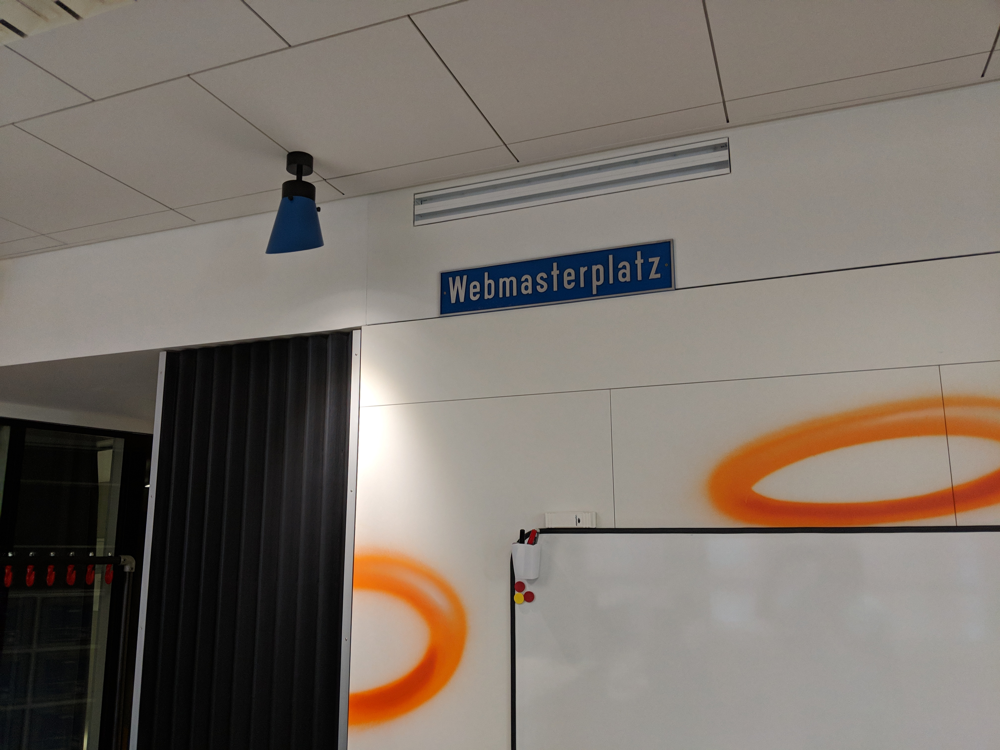

<!-- A new adventure -->

As a few people already know or have heard, I have recently left [Archilogic](https://spaces.archilogic.com) to join Google's "Webmaster Trends Analyst" team.
I am very thankful and happy to have a chance to join such a wonderful team of smart, friendly folks here in Zürich.

My role is Developer Advocate and my mission continues to be making the web better for users and developers alike. I feel like I have found my place here (quite literally, as you'll see below).

 

## Onto the rollercoaster!

I started in April and had a great time during "Noogler onboarding" where I was introduced to the Google culture, processes, tools and things to do.
I was very happy to see a good mix of people from various backgrounds, ages, genders in the group of Nooglers!

Soon after it was time to visit my first Google I/O - which will get its own post later. Let's just say I had a blast meeting so many wonderful folks from all around the globe and having the chance to talk to them!
Also, as a big fan of Justice, the concert was a nice surprise :)

## Same same but different

Basically work at Google feels like an extension of what I did mostly in my free time in the past, so this is great!
Of course there's some differences, such as the ability to work with people all over the world towards a common goal is quite a mindboggling difference!

While I won't be working with WebXR as my main focus, I will continue to contribute and build things with the great WebXR team here at Google.
So for me, you and the community not much will change :o)
