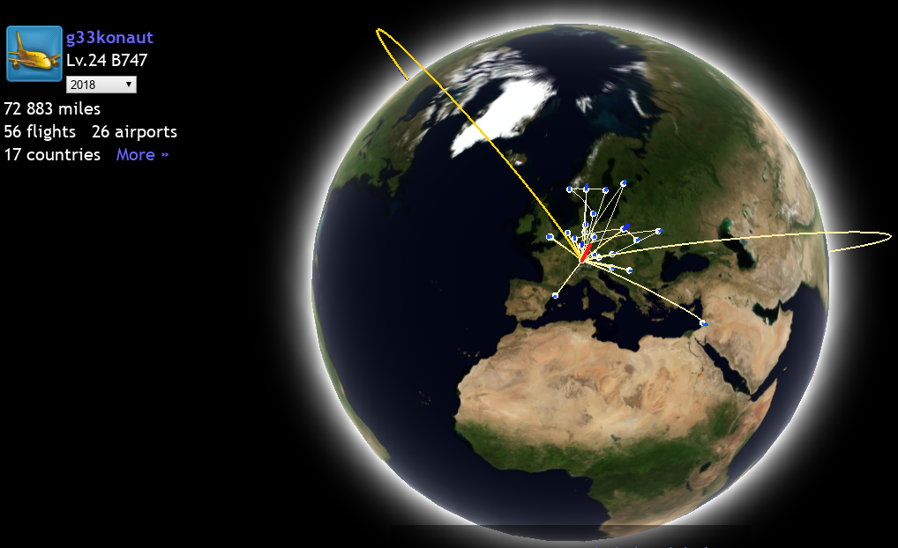
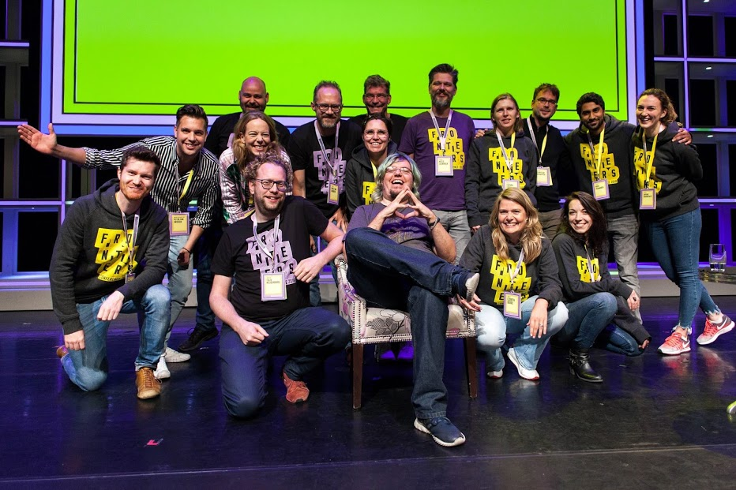

<!-- 2018: a retrospective -->

# 2018: A retrospective.

It's time to look back on this year while the last few days of 2018 are slipping through the present into the past. I will also think out loud about the upcoming year.

Let's start with what I said 2017 about this year.

## WebXR

I contemplated we'd see more progress for WebXR, which is the case. The TPAC meeting had a whole lot of conversations around it as far as I can tell. Also the [model-viewer](https://github.com/GoogleWebComponents/model-viewer) component makes it easier to showcase and embed glTF 3D assets. It was also present at the Chrome Dev Summit again.

## Speaking & teaching

Back in December 2017 I was looking forward to my lecture at the HWZ and I am happy with how it went. 

The year was busy with conferences again. I went to **35** events, speaking at 33 of them - sometimes with more than one talk. This meant taking 56 flights for 72,883 miles.

I also got the fantastic opportunity to be the MC at the amazing Fronteers conference. It was exhausting but incredibly wonderful.

## Diversity and community

I also had the honor to conduct mock tech interviews with a bunch of people, mentor a few lovely folks. Google also gave me the opportunity to teach kids programming with LEGO robots. I participated in 10 workshops for the [Open Roberta](https://www.roberta-home.de/) programme this year. I plan on continuing to host, moderate or support future workshops, too. The [Global Diversity CfP day](https://www.globaldiversitycfpday.com/) event I co-hosted at Digicomp was another milestone. The event was the starting point for a few people's speaking careers. It was a small step towards a more diverse set of voices on the stage of conferences and meetups.

Not everything went great, though. I pledged not to join conferences without diverse lineups. I failed the original goal. The last year I started to have more critical conversations though. I learned from my failures and stopped making unconditional commitments. It is vital for us as a community and industry to make sure we're holding each other accountable. I found out that often times lineups would change or not be available when I got contacted. I focused the conversations on who else got invited and why to make sure the values and goals of the conferences aligned with mine. This didn't always work out, but I learned how that happened and what to do about it.

I will continue to work with the Women Techmakers and other initiatives to make sure great voices will be heard. 

I was lucky enough to be able to support the women++ Hack'n'lead event and motivate a diverse group of people. They tried Dialogflow and built great applications for the Google Assistant.

Last but not least I became a co-maintainer for the [Rendertron](https://github.com/googlechrome/rendertron) project, thanks to the support of Google as my employer.

## 2019

With this year in the books, I am thinking what's next. I will continue to help the community grow and prosper, specifically the local communities in Zurich. That also means I won't do as many conferences as I did the last two years. While I love meeting people and exchanging ideas at conferences, I would love to empower others to do so as well. I am planning more videos, blog posts and open source work next year.
My biggest endeavour, though, will be to turn #FOMO (fear of missing out) into #JOMO (joy of missing out).
2018 taught me to enjoy the present and make deliberate choices about where I am and what I do. Let's do more of that next year!