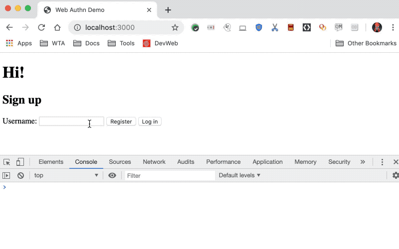
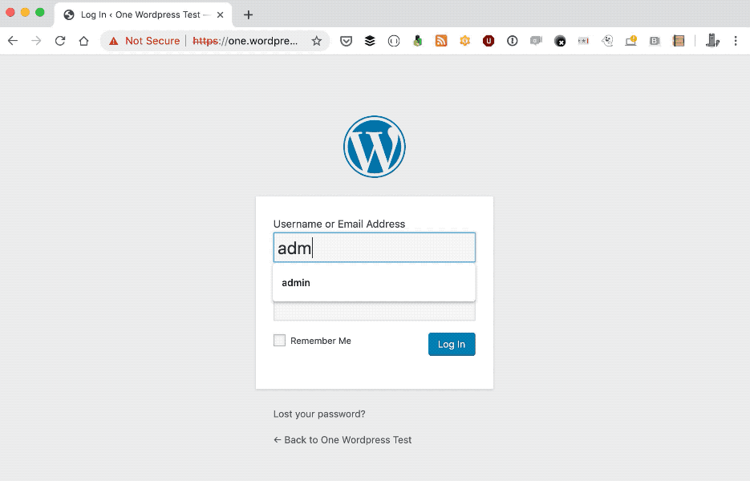

<!-- A look at how I build stuff -->

In this article, I want to take you behind the scenes on how the stuff I do usually works behind the scenes.
This is primarily about my side projects but this pretty much applies to things I do at work, too.
The point I'm trying to make here is that we all are struggling and failing when we learn new things - and that's okay!

The polished results you see are the destination of a messy, sometimes frustrating journey.
I want this to encourage you to go on your own messy adventure and push through the frustrations along the way,
because these frustrations are blessings in disguise - they're learning opportunities.

I wrote about [my general approach to side projects](/post/2017-05-08-how-i-approach-side-projects), but in this post I would like to give a real example of how that plays out.
So, let's embark on this specific journey from this week!

## TL;DR

The process is similar to [how I do side projects](https://50linesofco.de/post/2017-05-08-how-i-approach-side-projects) in general.

1. I had an idea to build a WordPress plugin for [Web Authentication](https://developer.mozilla.org/en-US/docs/Web/API/Web_Authentication_API).
2. I read the docs for the Web Authentication.
3. I built [a very hacky, throwaway prototype](../images/post-images/webauthn-journey/webauthn-prototype.gif).
4. I found out what I don't know and [read articles](https://medium.com/@herrjemand/introduction-to-webauthn-api-5fd1fb46c285#cff2), [the spec draft](https://w3c.github.io/webauthn/#sctn-intro), looked at [other implementations](https://github.com/herrjemand/FIDO2WebAuthnSeries/).
5. I learned how to [write a WordPress plugin](https://codex.wordpress.org/Writing_a_Plugin).
6. I combined the two things, one step at a time, into [another throwaway prototype](../images/post-images/webauthn-journey/wp-webauthn-prototype.gif).
7. I rejoiced!

## The inspiration and idea

Last week I had the honor to participate in the [WordCamp EU](https://2019.europe.wordcamp.org/) in Berlin.
I hang out with [Andre](https://twitter.com/ndrnmnn), who works in the security outreach team and was there to talk with people about making their sites more secure.
At some point, someone asked him how to make Web Authentication work for [two-factor authentication](https://en.wikipedia.org/wiki/Multi-factor_authentication) in WordPress and Andre asked me the same question afterwards.

I didn't know - but I knew I wanted to look into Web Authentication at some point, so I decided: Might as well do it now!
And while I'm at it, I might as well learn how to make a WordPress plugin for it... :)

So here I was, looking forward to learn two things:

1. How to use the Web Authentication API
2. How to build this into a WordPress plugin.

## Learning about Web Authentication

My starting point for learning a new Web API is usually [Mozilla's Developer Network](https://developer.mozilla.org/en-US/).
Sure enough they explained the browser-side of Web Authentication and gave me pointers for the server side.

"Phew", I thought, this is going to be a bunch of work. There are plenty of concepts to grasp 
(like relying party, authenticator, credentials, key, attestation, verification).
I read through the MDN documentation to understand the bird's eye view - 
what's the process, who are the involed parties and what are the key concepts, roughly.

Fundamentally, we want a server to be able to authenticate us by using a cryptographic public key.
To create a key pair with such a public key, we use an authentication device (e.g. a fingerprint sensor).
We also need to get that public key to the server. When we login later, 
we want the server to tell us which of our private keys we should use to make a signature.
Last but not least, the server should then use some data, 
our public key and the signature to make sure it's really us logging in.

Once I understood what parts are involved and how they interacted on a high level, 
I started exploring the API call within the JavaScript console of the browser devtools to see if I can get it to work.

Sure enough, after a bit of trial and error it produced a response with plenty of stuff in it. Time to go further.

I threw together a very basic [express.js server](https://expressjs.com/) that had four endpoints:

1. `/create-credentials` would return the parameters to create a new set of credentials in the browser.
2. `/register` would take the credentials created via the Web Authentication API, a username, a password and store the user in a dictionary.
3. `/get-credentials` would take a username and password and if those match it would return the credential ID that it has stored for this user. 
4. `/login` would take the authentication assertion that the Web Authentication has generated for the given credential ID, verifies it and logs the user in.

I built each of those step by step. I had to re-read the specs and examples from other implementations over and over again to get them all work.
Once I had all the little bits working together, I enjoyed the fruit of my efforts:

## Learning how to make a WordPress plugin

Now it was time to bring this into WordPress.
I started by finding out [how to write a WordPress plugin](https://codex.wordpress.org/Writing_a_Plugin).
Knowing that there are actions and filters, I needed to find out which of those I needed for my plugin.

As that depends on what you are planning to do, I sat back and thought about the process and flow that I wanted to implement.

For a user to enable 2FA with Web Authentication, I wanted something like this:

1. A user would log in to WordPress and go to their profile page.
2. In the profile, they click on a "Set up 2FA" button.
3. The browser prompts for their authentication (e.g. by fingerprint).
   If that works, the data is sent to the server.
4. The server stores the credentials for the user.

For the login, the process I wanted was like this:

1. A user enters username and password.
2. If the data is valid, the server checks if the user has credentials stored, too.
3. If there are Web Authentication credentials, send the data to authenticate the user to the browser.
4. The browser now requests authentication and sends the data back to the server.
5. The server logs the user in, if the server can successfully verify the data.

Great - that helped me figure out which action and filters I needed. So, off we go!

This is where things got frustrating - I made the mistake to look at existing libraries 
to generate the necessary data and verify the authentication data. 
This added to the moving parts rather than removing them as it turned out.

After a short while, I found [a simple library](https://github.com/davidearl/webauthn) for this but ended up heavily simplifying it anyway.
And et voila - I got it working!

## What's next?

So, will I publish any of the code? 

No.

The code was deliberately built to be throwaway prototypes to help me understand and check if what I learned works the way I thought it would.
There are libraries out there which are more feature-complete, secure and flexible implementations of the API and processes.

Well, the end goal was to provide Web Authentication for WordPress and I will do my best to make that happen.
I don't need to do this from scratch, as there is [this feature project to provide 2FA for WordPress](https://github.com/georgestephanis/two-factor) to which I will contribute.