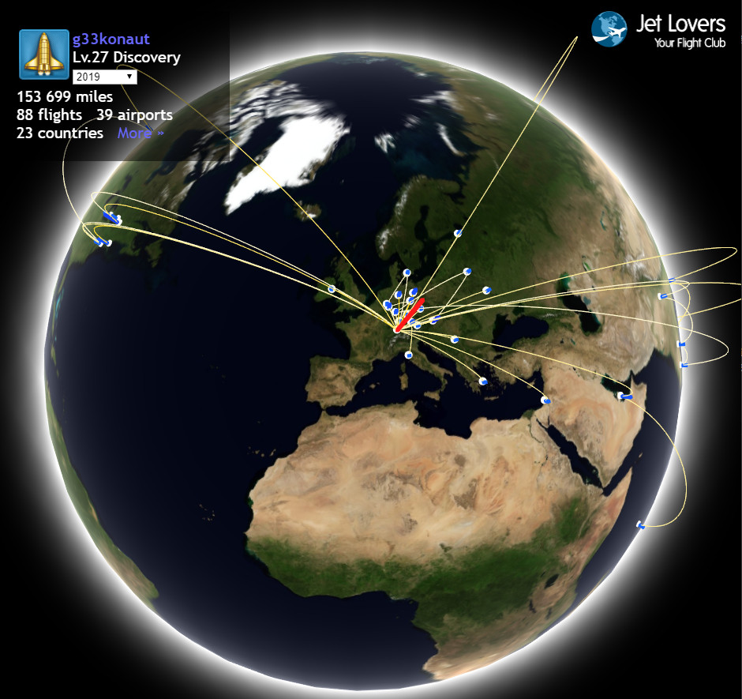
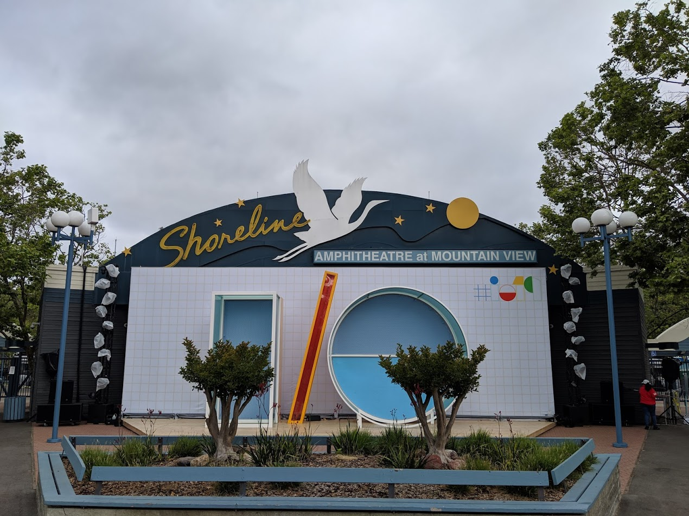
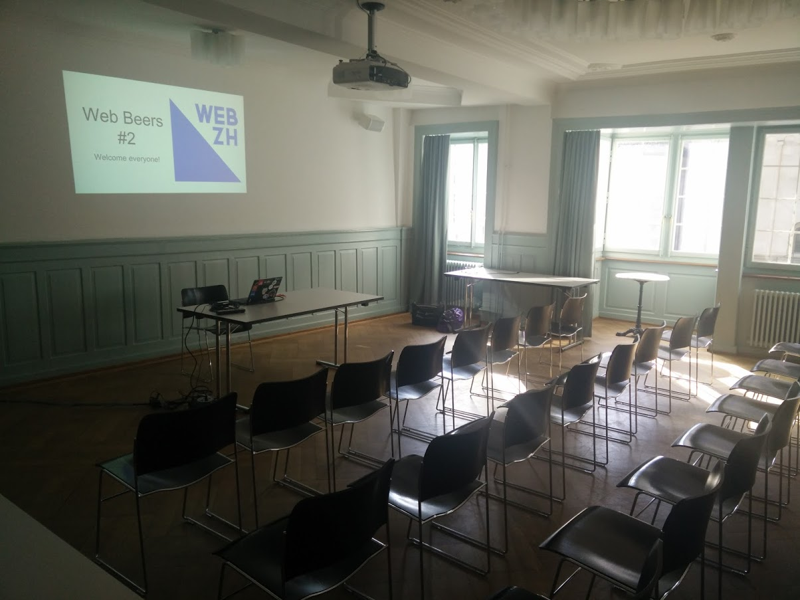
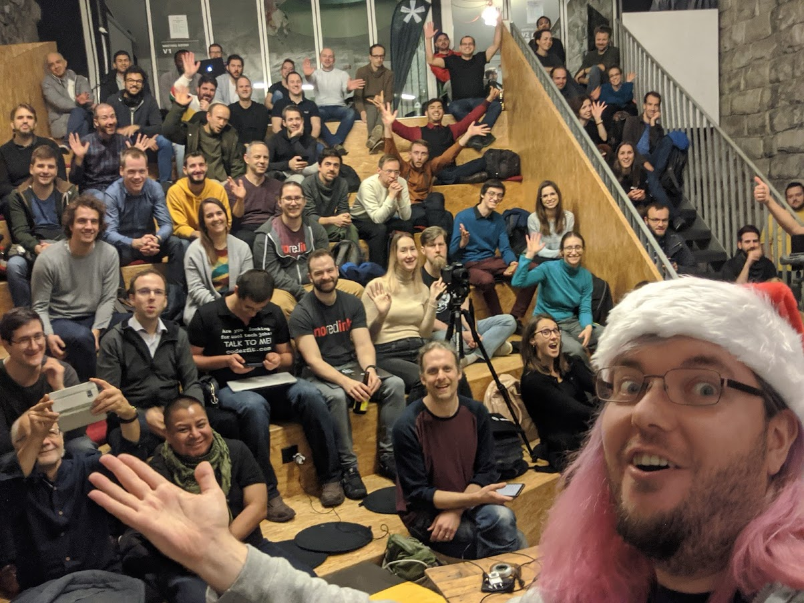
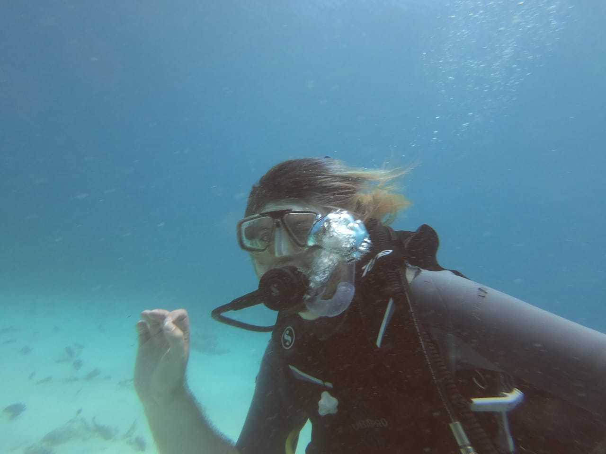
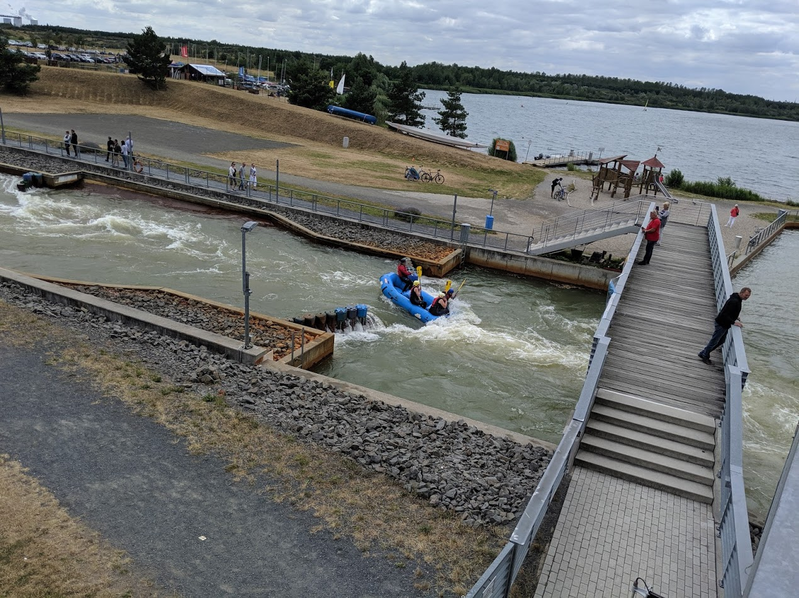
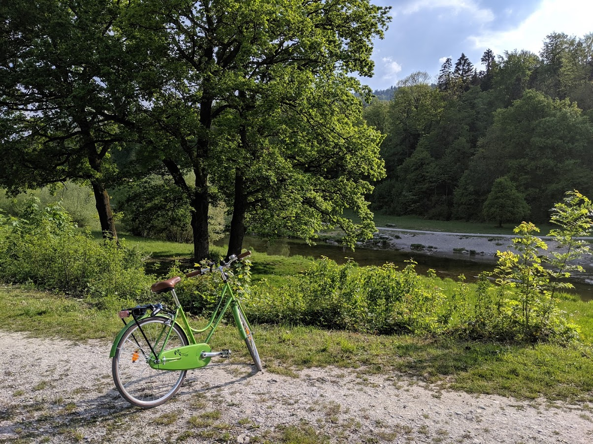
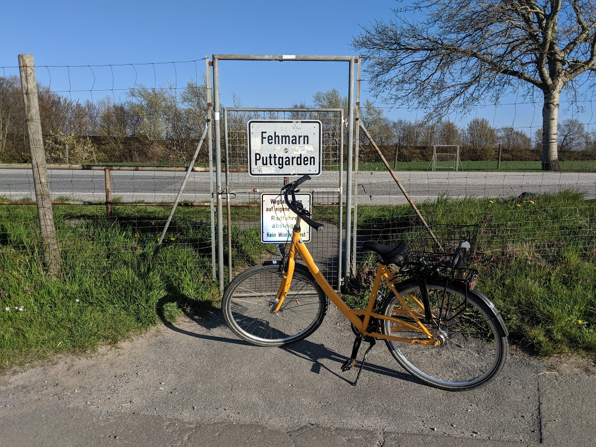

<!-- 2019 a retrospective -->

A look at what I thought 2019 would be like, how it was like and a few guesses for 2020.

## What I wrote a year ago

Before we review how the year *actually* went, let's see what I thought about it a year ago before it started :)

Quoting the prognoses from [my 2018 revue post](/2018-a-retrospective):

- fewer conferences
- more videos and blog posts
- more open source work
- less #FOMO, more #JOMO
- more enjoying the moment and making deliberate choices

Right, that'll gives us a few things to go through, I guess.
Let's start with the conferences..

## The community at large

In short, the attempt to go to fewer events failed. I got better in saying "No", yet the amount of requests increased over-proportionally.
This resulted in 56 conference talks and 12 meetup talks I've done in 2019. It also came with a lot of travel:

I took 88 flights for a total of 153.699 miles. It was a huge blessing to be sharing stages with many brilliant people, meeting old and new friends.
I'm truly blessed to be part of this amazing, global network of wonderful people!

One highlight definitely was the opportunity to be a speaker at Google I/O for the first time with John as well as a second time with Zoe.

The opportunity to visit communities around the globe and hear about the different challenges people were facing when it comes to technical SEO was amazing and I'm very grateful for all the conversations I had throughout the year.

These conversations also lead to a lot of other activities off-stage:

- We produced a bunch of videos, most of which will be released in 2020.
- We created a lot of documentation by either extending existing docs or writing completely new ones.

That being said, I did achieve the "more videos" goal.

## Local community

I am beyond blessed to have a fantastic team of co-organisers for [Web Zürich](https://webzueri.ch) and together we ran another year of monthly meetups and some workshops on top! I ran a Hacktoberfest event in Zurich, Aleksej organised a Vue.js workshop with Chris Fritz and Vitaly Friedman was so kind to join us for a "New frontend adventures" workshop in December, too! 

When Web Zuerich started with the [first monthly meetup event](https://www.meetup.com/de-DE/Web-Zurich/events/231415028/) on June 2nd, 2016 with 10 people attending, I couldn't imagine what we, the team, would put together and run for now more than three years. This year we also took a big step forward in what we can do with [this amazing community of over 1900 people](https://www.meetup.com/de-DE/Web-Zurich) by founding the Web Zurich Verein to foster the local web creator community.

Here is a picture from the first meetup:

And here is one from our December 2019 meetup (note: I couldn't even fit everyone into the picture):

I also had the opportunity to support events from other communities in Zurich, like Vue Vixen Switzerland or the Women Techmakers!

## Off the clock and in the moment

Last but not least, I wanted to continue to enjoy a healthy, happy life among friends and turn the fear of missing out (FOMO) into the joy of missing out :)
The year started with a trip to the Seychelles where I jumped in at the deep end, literally, and finally made my OWD (open water diver) certification - a lifelong dream of mine.

Since then I've been enjoying more diving education and practice in Germany and Switzerland and I just love it. It's like meditation, but you get to look at cute fishes some of the time.

On top of that, I went for a rafting course, because why wouldn't I?

I also rediscovered cycling and did roughly 680 kilometers of it this year. This includes biking to and from work but also some trips along the lake, rivers as well as during vacation. This, combined with a more attentive, healthy and balanced diet, helped me to lose 5kg over 6 months!

On top of this, I also picked up magic tricks and found that I really enjoy performing a trick here and there for friends as well as complete strangers. It brings a special kind of joy to engage in storytelling, sleight of hand and creating amazement and wonder in the spectators.

I think I did successfully shift focus to the present, enjoying time with family and friends and doing activities that make me happy, so that's the biggest win of 2019!

## A look forward

Now, this post would not be complete without some speculative predictions of what I would like 2020 to hold for me. Here goes nothing:

- I plan on practicing my tricks to the level that I can do a little stage magic show (I am VERY scared of this, btw)
- I want to do my Advanced Open Water Diver certification and do a lot more diving throughout the year (my goal is to have reached 30 dives by 2021. I've got 9 so far...)
- I would like to empower and support others on their way to the stage. Rather than doing many talks myself, I'd love to elevate voices that we usually don't hear but should.
- I will continue to support local events and the local community as part of Web Zurich's team and supporter for other local communities.
- I wanna get rid of another 5 kilograms :)

And with that: Cheerio, on to a happy, healthy 2020!
